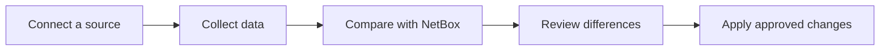

# NetBox SSoT

NetBox SSoT helps teams bring infrastructure data from supported source systems into their local NetBox through a clear,
reviewed workflow.

It collects remote data, shows how the two systems differ, and lets an authorized operator decide exactly what should
change. Collection and comparison are always read-only. NetBox changes only after an explicit review and apply.

> [!IMPORTANT]
> NetBox SSoT is early-stage software. Version 0.0.1 is intended for evaluation and carefully supervised deployments
> while the project matures.

## What it provides

- **A clear view of drift** — See how closely each source matches local NetBox and which records need attention.
- **Scheduled collection** — Keep source data current automatically, or request an immediate run when needed.
- **Guided review** — Inspect creates, updates, matches, conflicts, and skipped records before anything changes.
- **Controlled apply** — Approve or reject changes, then apply an approved plan as one transaction.
- **Operational visibility** — Follow agent health, collection progress, background work, failures, and recent activity
  from the NetBox UI.
- **An audit trail** — Retain collections, decisions, approvals, applications, and outcomes for later review.

## How it works

1. **Connect a source** — Choose a provider, select the data to manage, and assign a collector agent.
2. **Collect data** — The agent reads the remote system on a schedule and sends an immutable snapshot to NetBox.
3. **Compare** — NetBox prepares a drift assessment against its current local records.
4. **Review** — Operators inspect proposed changes and resolve anything that cannot be matched safely.
5. **Apply** — An authorized operator applies the approved plan after NetBox validates it again.

## Built for safe reconciliation

NetBox SSoT keeps discovery separate from mutation:

- Collector agents cannot modify either NetBox installation.
- Remote credentials stay on the agent host and are not stored by the plugin.
- Missing or ambiguous identities are shown for review instead of being guessed.
- Incomplete collections cannot be used to infer deletion.
- Destination-only records are left alone, and hard deletion is not supported.
- Every apply is revalidated and committed atomically.
- Review and apply permissions can be assigned to different people.

## Included providers

The NetBox provider connects one NetBox installation to another and covers portable infrastructure and configuration
data across Core, Extras, Users, Tenancy, IPAM, DCIM, Circuits, Virtualization, VPN, and Wireless. The UniFi Network
provider uses the official Integration API to collect sites, adopted infrastructure devices, interfaces, management
addresses, VLANs, prefixes, and wireless networks without collecting volatile clients or credentials.

The current write direction is **source system to local NetBox**. Bidirectional synchronization is not enabled.

See the [provider documentation](providers/README.md) for each dataset boundary and implementation details.

## Start using NetBox SSoT

An administrator first installs the [NetBox plugin](packages/plugin/README.md) and deploys a
[collector agent](agent/README.md). After that, the guided setup happens in NetBox:

1. Open **SSoT → Providers** and choose a provider.
2. Configure the source and select the datasets to manage.
3. Connect a collector agent using the enrollment command shown by NetBox.
4. Test the connection or request a collection.
5. Open the resulting reconciliation to compare, review, and apply.

The source page updates automatically while commands and collections are running.

## Day-to-day use

The plugin organizes work around four areas:

- **Overview** shows estate alignment, recent drift, and sources that need attention.
- **Sources** manages remote systems, data scope, collection schedules, and collection history.
- **Reconciliations** brings collection, comparison, review, and apply into one workflow.
- **Activity** records administrative actions, agent events, and synchronization outcomes.

## Documentation

- [Plugin installation and administration](packages/plugin/README.md)
- [Collector agent deployment](agent/README.md)
- [Provider implementations](providers/README.md)
- [Shared Python contracts](packages/contracts/README.md)
- [Go runtime internals](internal/README.md)
- [Architecture overview](docs/architecture/overview.md)
- [Architecture decisions](docs/adr)
- [Contributing guide](CONTRIBUTING.md)
