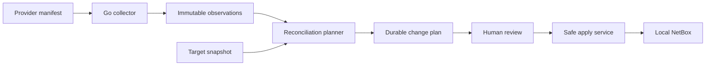

# NetBox SSoT

NetBox SSoT is a provider-driven discovery and reconciliation system for NetBox. It separates remote collection, immutable observations, change planning, human review, and mutation so that discovering a network never implies changing it.

The project is being rebuilt from first principles. The current alpha foundation contains:

- a NetBox-independent contracts package for providers, observations, and plans;
- an entry-point provider registry with no database-configured Python import paths;
- a NetBox plugin with schema-driven sources, one-time agent enrollment, signing-key rotation, immutable observation storage, durable
  comparison previews, guarded local application, receipts, source-object bindings, and agent health visibility;
- a real NetBox provider descriptor and Go-based read-only collector;
- end-to-end comparison and guarded apply support for every public writable NetBox 4.6 DCIM resource;
- timestamped Ed25519 batch signing with idempotent plugin ingestion; and
- architecture decisions that make review, provenance, field ownership, and safe apply mandatory.

No provider or customer-edge agent can mutate NetBox or any discovered system. Local NetBox writes exist only behind
the plugin's separately permissioned, human-confirmed apply service.

## Architecture



See [the architecture overview](docs/architecture/overview.md) and the decisions in [`docs/adr`](docs/adr).

## Development

Python 3.12 and [uv](https://docs.astral.sh/uv/) are required.

```shell
uv sync --all-packages
uv run ruff check .
uv run mypy
uv run pytest tests --cov
```

The NetBox-independent suite above is complemented by the database-backed plugin suite in CI. See
[CONTRIBUTING.md](CONTRIBUTING.md) for the equivalent NetBox, PostgreSQL, and Redis-backed local commands.

The repository is a uv workspace:

- `packages/contracts` contains stable, NetBox-independent public contracts.
- `packages/plugin` contains the NetBox plugin and UI integration.
- `providers/netbox` contains the shared NetBox manifest, Python control-plane descriptor, and Go collector.
- `agent` builds the single customer-edge binary.
- future production providers will live below `providers/`.
- all customer-edge collection runs in the Go agent; Python is confined to the NetBox control plane.

## Compatibility target

The first supported NetBox line is 4.6. Provider contracts are independently versioned so provider releases do not need to share the plugin release cadence.

## Automatic agent workflow

The plugin UI is organized around **Overview**, **Sources**, and **Activity**. Provider-specific dataset names and
configuration fields come from the installed provider manifest; the shared workflow does not hard-code NetBox model
names.

Build the static customer-edge agent:

```shell
CGO_ENABLED=0 go build -trimpath -o dist/netbox-ssot-agent ./agent/cmd/netbox-ssot-agent
```

Create a source in **Discovery > Sources**, choose its execution agent, and set the collection interval. NetBox stores
provider configuration and opaque secret references. The provider credentials and the agent private key remain only on
the agent host.

Open **Discovery > Agents > Connect agent**, optionally select initial source assignments, and create a 15-minute,
single-use enrollment token. An agent enrolled without sources remains available as a standby. On the agent host, run
the generated command. The agent creates its Ed25519 private key as a new mode-`0600` file and submits only the public
key plus the provider implementations compiled into that binary:

```shell
export NETBOX_SSOT_ENROLLMENT_TOKEN='<one-time token shown by NetBox>'
sudo install -d -m 0700 /etc/netbox-ssot-agent
sudo -E ./dist/netbox-ssot-agent enroll \
  --endpoint https://netbox.example.com/api/plugins/ssot/agent/enroll/ \
  --token-ref env://NETBOX_SSOT_ENROLLMENT_TOKEN \
  --private-key-path /etc/netbox-ssot-agent/signing-key
unset NETBOX_SSOT_ENROLLMENT_TOKEN

export NETBOX_TOKEN='<raw NetBox token>'
export NETBOX_SSOT_LOG_LEVEL='info'
./dist/netbox-ssot-agent run \
  --endpoint https://netbox.example.com/api/plugins/ssot/agent/config/ \
  --agent-id '<enrolled agent UUID>' \
  --private-key-ref file:///etc/netbox-ssot-agent/signing-key
```

NetBox stores only a SHA-256 digest of the enrollment token and never stores the private key. The raw token is shown
once. Reuse, expiry, and revoked enrollment attempts return the same generic failure.

The agent authenticates each configuration request with Ed25519, fetches only its assigned sources, immediately picks
up source revisions, runs each source on its configured interval, and submits the resulting batch through the signed
ingest API. Retryable failures are scheduled again after one minute. The ingest endpoint must have the same origin as
the control endpoint.

Every configuration poll is also a heartbeat. **Discovery > Agents** shows the reported agent and protocol versions and
classifies the connection as online, stale, or offline. Source pages combine that heartbeat with the latest collection
and configured interval to show the last success, next expected collection, and actionable health state. Operators with
the `netbox_ssot.add_agentcommand` permission can request **Test connection** or **Run now** from a source. These are
provider-independent commands: NetBox queues them for the assigned agent, the agent executes them with its local
credentials, and it signs the result back to NetBox. Command state and summaries appear on the source and in Activity.
Only one active command of each kind may exist per source. Reassigning or disabling a source cancels outstanding work.
The control poll is independent of every source collection interval. It defaults to five seconds and can be changed
from **Discovery > Agents > Settings** within a supported range of two to thirty seconds. `--poll-interval` supplies the
bootstrap value until the first successful check-in; the agent then adopts the NetBox-managed value without a restart.
The agent reports its effective interval so the UI can show desired-versus-reported state, the actual worst-case pickup
delay, and heartbeat health against that cadence.

Collection results provide a provider-neutral observation explorer. Model summaries use provider manifest names,
support search, sorting, and pagination, and drill into paginated collected records. Record pages show canonical
attributes, relationships, evidence, scope, safe source-system links, and unresolved relationship targets without
mixing collection inspection with destination comparison or mutation.

Each source also owns an explicit retention policy. By default, successful collections are retained for up to 30 days
and 10,000 runs, while partial and failed collections are retained for 30 days. The newest collection, newest
successful collection, and every collection referenced by a review or application are protected. Preview maintenance
without deleting data:

```shell
python manage.py prune_ssot_collections
python manage.py prune_ssot_collections --source '<source UUID or exact name>'
```

After reviewing the exact run and observation counts, add `--apply` to perform transactional cleanup. Cleanup is never
triggered by a page view, agent poll, or collection request.

Protocol 1.1 adds this command channel. The plugin continues to answer protocol 1.0 agents with the legacy assignment
response, but UI actions require a current protocol 1.1 agent. Command result delivery is retried without repeating the
operation while the agent process remains running, and **Run now** uses its command UUID as the batch run ID so ingest
idempotency also protects redelivery across restarts.

Agent `0.6.8` advertises its compiled provider implementation and contract versions during enrollment and every
check-in. NetBox permits assignment only when the agent supports the installed provider version; incompatible existing
assignments are withheld and surfaced as unhealthy until they are reassigned or the binary is upgraded. Agent `0.6.8`
also keeps the control poll responsive while provider work runs in a bounded pool of four workers. Only one
job may run for a source at a time, and queued administrator commands take precedence over scheduled collections when
a worker becomes available. Commands progress through Pending, Dispatched, Running, Reporting, and a terminal state;
the UI records their start time and duration. Active command IDs renew a five-minute server lease on every control
poll. If an agent disappears, expired work is made available again, while an already accepted **Run now** batch is
reconciled to success instead of executing the provider operation twice.

Structured logs are written to stderr, while command and synchronization results remain JSON on stdout. The log level
can be set to `debug`, `info`, `warn`, or `error` with `--log-level` or `NETBOX_SSOT_LOG_LEVEL`; `info` is the default.
Use `debug` to inspect configuration polling, queue depth, worker occupancy, command dispatch and progress, collection
counts, revision-triggered runs, result delivery, recovery, and scheduling decisions.

At `info`, the agent records initial configuration and every subsequent agent/source configuration change, including
safe source identity, provider, dataset IDs, revision, and collection/control intervals. Removed assignments are also
recorded. Provider configuration values and secret references are deliberately excluded from logs.

Failed control-plane check-ins use capped exponential backoff starting at the configured control interval. The delay
doubles after every consecutive failure until it reaches five minutes, then remains at five minutes. A successful
check-in resets the delay immediately to the normal administrator-configured interval. Failure and recovery logs
include the consecutive failure count and next retry delay without exposing signed payloads or credentials.

Scheduled collection backpressure is opt-in and disabled by default. Enable it in the NetBox configuration when a
source should stop producing snapshots while its latest complete collection is awaiting review:

```python
PLUGINS_CONFIG = {
    "netbox_ssot": {
        "pause_scheduled_collections_until_resolved": True,
    },
}
```

With this enabled, agent `0.6.8` keeps the assignment and administrator command channel active but pauses its local
schedule. A no-change comparison, finalized rejection, or successful application resumes collection. A finalized
approval remains paused while it waits for apply. **Run now** remains an explicit way to refresh and supersede the
pending snapshot; the new complete snapshot then becomes the one awaiting resolution.

For a Linux service, install the binary at `/usr/local/bin/netbox-ssot-agent`, copy
`agent/deploy/systemd/netbox-ssot-agent.service` to `/etc/systemd/system/`, and create
`/etc/netbox-ssot-agent/agent.env` from the provided example with mode `0600`. The service uses systemd credentials to
expose the private-key file read-only to its dynamic user. The endpoint and agent ID may be supplied through
`NETBOX_SSOT_CONTROL_ENDPOINT` and `NETBOX_SSOT_AGENT_ID`, so the service needs no customer-specific command line.

Use `config` to inspect assigned configuration or `sync` to run every assignment once. Manual provider commands remain
available for troubleshooting:

```shell
./dist/netbox-ssot-agent config --endpoint '<control endpoint>' --agent-id '<agent UUID>'
./dist/netbox-ssot-agent sync --endpoint '<control endpoint>' --agent-id '<agent UUID>'
./dist/netbox-ssot-agent test-connection --request netbox-connection.json
./dist/netbox-ssot-agent collect --request netbox-collection.json
```

Rotate a file-backed key from **Discovery > Agents > Settings** using the displayed `sudo` command; enrollment creates
the mode-`0600` key as root, so rotation must run as that key owner. NetBox accepts the old key for ten minutes, records
both key fingerprints and the audit event, and then retires it. Restart the running agent service during that overlap
so it reloads the replaced key (and refreshes the systemd credential snapshot). Emergency
revocation immediately disables the agent, revokes every active/overlapping key, and fails its outstanding commands.
For a lost key or host replacement, **Replace agent** creates a separate one-time enrollment. The old identity remains
valid until that enrollment succeeds, then NetBox atomically revokes its keys while preserving the agent UUID and all
source assignments. Sources can be moved between compatible agents from their edit page; assignment, replacement, and
capability changes are recorded in Activity.
The provider token and signing private key never enter a batch or the plugin database. Identical submissions are
idempotent, and reusing a run ID with different content is rejected.

## Comparison and apply workflow

Open an accepted collection and select **Review changes**. The plugin projects the immutable source
observations and a consistent local target snapshot into in-memory DiffSync adapters. It stores the resulting creates,
updates, exact matches, conflicts, and skips as an immutable comparison preview. Destination-only objects are excluded,
and no comparison path exposes DiffSync synchronization or NetBox model mutation.

Matching uses exact, kind-specific natural identities. Missing identities and ambiguous source or target identities are
shown as skips or conflicts rather than guessed. Repeating a comparison against the same target snapshot and engine
version returns the existing preview.

Operators with the `netbox_ssot.add_comparisonreview` permission can approve or reject each proposed create or update.
Changing a decision appends another audit event; it never edits the prior decision. Final approval requires every
actionable record to be approved and no conflicts or skips. A rejection requires a reason and finalizes the whole
comparison. V1 deliberately does not turn rejected records into a partial apply.

Finalization stores an immutable review with the reviewer, outcome, counts, reason, and a digest over the comparison,
all comparison items, and the latest decision for every item. An operator with the separate plugin apply permission and
the necessary NetBox model permissions can explicitly apply only a finalized approval. Apply rechecks the review
digest, complete collection evidence, source digest, item counts, comparison engine, and current target snapshot. It
orders the complete supported dependency graph and commits supporting references, geography, device-catalog, and rack
objects in one database transaction. Every successful operation creates immutable apply/item receipts and updates
durable source-object bindings. Repeating the same apply is idempotent. Destination-only objects are never changed,
and there is no deletion path.

The NetBox provider exposes dependency-closed datasets for the complete public writable DCIM model surface: geography,
device and module catalogs, component templates, racks and reservations, devices and installed components, inventory,
MAC addresses, power, and cabling. Internal aggregate/helper rows such as cable terminations and port mappings travel
with their owning DCIM object rather than as independent resources. References owned by other NetBox apps remain
resolve-only: Config Templates and ASN Roles must match exactly, and Rack Reservation users must match a unique local
username. A cable or generic assignment that crosses into an unsupported app is skipped rather than partially applied.

Deployments that require four-eyes approval can prevent the final reviewer from also applying the comparison:

```python
PLUGINS_CONFIG = {
    "netbox_ssot": {
        "require_separate_reviewer_and_applier": True,
    },
}
```

### Current NetBox compatibility scope

The NetBox provider presents five selectable datasets: Regions, Sites, Locations, Device catalog, and Racks. A hidden
supporting dataset is included automatically so the Go collector can emit complete, stable references rather than
lossy embedded names. Selecting Racks closes the dependency graph through Locations and Device catalog automatically.

Each dataset also declares its provider-native source model and canonical destination kind. The source detail UI joins
that declaration with the installed destination model registry and presents an explicit source-to-destination mapping;
the shared UI never assumes that both systems use the same model names.

- Tags include name, slug, color, weight, description, object-type restrictions, and Owner.
- Owner Groups and Owners include their portable identity, description, and grouping. Local user/group memberships are
  intentionally excluded because they belong to the destination authorization domain.
- Tenant Groups, Tenants, and Site Groups include full hierarchy, native fields, Owner, and Tags.
- RIRs and ASNs include native fields, ownership, tenancy, Tags, and required RIR placement. ASN Role is resolve-only.
- Regions, Sites, and Locations include native scalar fields, complete hierarchy, ownership, tenancy, groups, ASNs,
  and Tags.
- Device catalog includes Manufacturers, hierarchical Device Roles and Platforms, and Device Types with native core
  fields, ownership, Tags, manufacturer placement, and default-platform relationships. Config Templates are
  resolve-only and must already have one exact matching name in the target.
- Racks includes Rack Groups, Rack Roles, Rack Types, and Racks with native core physical fields, ownership, tenancy,
  type, role, Site/Location placement, and Tags.

Custom fields, contact assignments, image attachments, device-type component templates, Devices, and rack reservations
remain outside this compatibility boundary. They require their own complete dependency and ownership rules rather than
shallow observation-only support.

## Safety defaults

- Sources are discovery-only unless a separately reviewed apply capability is enabled.
- DiffSync is a compare engine; its model CRUD hooks will not mutate NetBox.
- Destination-only records are skipped by default.
- Hard deletion is disabled.
- Secrets are represented by opaque references and are never stored in observations or plans.
- Fuzzy matches are suggestions, never automatic identity decisions.
- Incomplete collection cannot establish absence.
- Complete batches retain their resolved dataset IDs alongside the completeness token.
- Agent private keys stay customer-side; the plugin stores only Ed25519 public keys and key fingerprints.
- Enrollment tokens are random, single-use, expire after 15 minutes, and are persisted only as SHA-256 digests.
- Key rotation has a bounded overlap for safe process restart; revocation is immediate and auditable.
- Signed ingest rejects stale timestamps, tampered bodies, disabled agents, and sources outside an agent's assignment.
- A plan must be revalidated against the current target immediately before apply.
- Apply requires explicit confirmation plus plugin and model permissions, uses one transaction, and records receipts.
- Apply requires an immutable finalized approval; optional four-eyes policy separates the reviewer and applier.
- Unmodeled references such as ASN Roles are resolve-only; missing or ambiguous dependencies block the operation.
