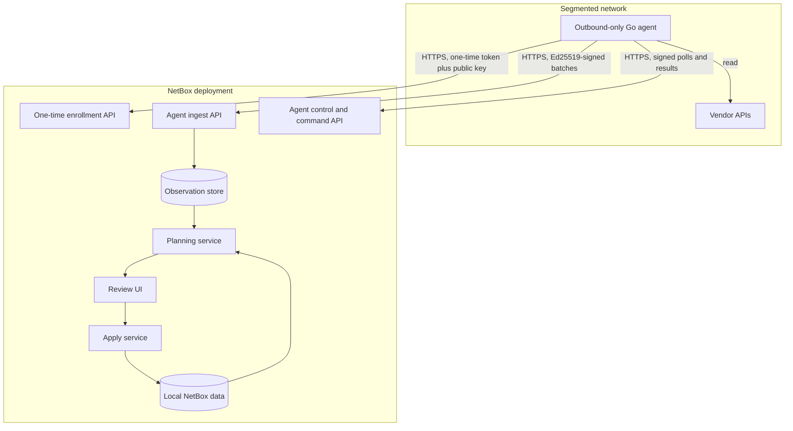

# Architecture overview

## Product boundary

NetBox SSoT discovers external state and proposes how a local NetBox target could be reconciled with it. Discovery, comparison, approval, and mutation are separate capabilities. A source provider can never acquire target write authority merely because it can collect data.

Each enabled source is assigned to exactly one collector agent. The agent signs a control request, pulls its provider
configuration, selected datasets, interval, and revision from NetBox, resolves secret references locally, and submits
the resulting observation batch through the existing signed ingest boundary. Agents poll for configuration changes but
schedule collections locally; editing a source changes its revision and causes the assigned agent to run it promptly.
The same outbound control poll records a heartbeat and can deliver durable, provider-independent Test connection and
Run now commands. Agents sign command results back to the plugin, and those results become operational evidence in the
source and Activity views.

The control loop does not wait for collection work. A bounded four-worker pool executes jobs, with at most one active
job per source, while polling and lease renewal continue at the configured control interval. Administrator-requested
commands are selected before scheduled work whenever capacity becomes available. Command progress is durable, and
expired leases can be reclaimed after a process or host failure. A Run now command whose deterministic run ID already
exists in the observation store is completed from that accepted evidence instead of being executed again.

Consecutive control-plane failures use exponential backoff beginning at the configured check-in interval and capped
at five minutes. Once capped, the agent retries every five minutes. Any successful check-in resets the backoff to the
normal configured interval, preserving responsive administrator actions after recovery.

The current implementation includes durable comparison previews and a separately permissioned local NetBox apply
boundary. Provider collectors and agents remain read-only and cannot reach the target write service.

The selectable target boundary covers portable Core Data Sources, every public writable NetBox 4.6 DCIM and Circuits
resource, and the portable Users access-control graph through dependency-closed datasets: Data Sources, Users, Groups,
Object Permissions, geography; device, module, rack, and circuit catalogs; component templates; racks and reservations;
devices and their installed components; inventory and MAC addresses; power; physical and virtual circuits; circuit
groups; and cabling. The automatically collected support graph also includes Tags, Owner Groups, Owners, Tenant Groups,
Tenants, RIRs, and ASNs. Internal aggregate/helper rows such as Cable Terminations, Cable Paths, Port Template Mappings,
and Port Mappings are projected and written through their owning DCIM object rather than advertised as standalone
resources.

Passwords, superuser state, API Tokens, login activity, built-in Django permissions, private UserConfig preferences,
Owner-to-user/group memberships, Data Source credentials and unknown backend parameters, generated Data Files,
synchronization/job/audit/background-worker state, ASN Roles, Config Templates, Rack Reservation users, custom fields,
contact assignments, and images remain outside the owned graph or resolve-only. Cross-app device addressing/cluster
fields, Interface IPAM and wireless-policy fields, VM-interface MAC assignments, and wireless cable endpoints are not
silently discarded: a record whose generic relation or cable termination crosses the supported graph fails closed and
is shown as blocked before apply. Circuit Terminations are supported cable endpoints and belong to the Circuits
ownership graph.

The initial bounded contexts are:

1. **Provider catalog** discovers installed provider descriptors and exposes their declarative capabilities.
2. **Collection** executes a compiled collector through an outbound-only Go agent.
3. **Observation store** records immutable, canonical facts with scope, evidence, and provenance.
4. **Reconciliation** compares a selected observation set with a fresh target snapshot and materializes a durable plan.
5. **Review** records immutable decisions for proposed record changes without changing the target.
6. **Apply** revalidates an approved plan, orders dependencies, performs supported NetBox writes, and records receipts.

## Trust boundaries

- Agents initiate outbound connections; the plugin does not require inbound reachability to private networks.
- A single-use, short-lived enrollment token authorizes creation of one agent identity. NetBox stores only its digest;
  the raw token and generated private key remain outside the database.
- Agent public keys identify an agent and authorize narrowly scoped control and batch submission, not NetBox CRUD. Optional mTLS
  can be enforced at the reverse proxy as an additional transport control.
- Signing keys have durable fingerprints and state. Rotation is signed by the current key, introduces a ten-minute
  overlap for process restart, and retains audit history; revocation disables the agent and all usable keys immediately.
- UI actions create durable commands but never call a provider directly. The assigned agent receives commands through
  its outbound poll, and each signed result is accepted only for the same agent, source, command ID, and command kind.
- Provider manifests contain declarative JSON only. They cannot inject scripts, templates, HTML, or import paths.
- Installed Python distributions advertise control-plane descriptors through the `netbox_ssot.providers` entry-point group. Collection code is compiled into the Go agent and matched by provider ID.
- Secrets are resolved only at execution time from opaque references. Observation and plan contracts reject secret-bearing fields by design.

## Core data flow

### Collect

A collection request identifies a source, provider contract, datasets, scope, and execution deadline. Its result contains a completeness state and a set of immutable observations. A complete result means only that the provider enumerated the declared scope; it does not mean the data is authoritative for every field.

The observation explorer is a read-only projection of that immutable run. Provider manifests supply model and dataset
labels, while canonical observations supply record identities, attributes, relationships, evidence, and scope. Links
to source records are constructed only from validated provider URL metadata and evidence object IDs. Relationship
status is evaluated within the same run, so a missing target is shown as unresolved rather than inferred from another
collection or from the destination.

Immutable evidence is retained according to source-owned age and successful-run limits. Retention always protects the
newest run, newest successful run, and any run referenced by a durable review; applied evidence is therefore protected
transitively. Cleanup is an explicit dry-run-first maintenance operation. It locks eligible runs, rechecks review
protection, removes their observations, and only then removes the unreferenced collection records in one transaction.

### Plan

The planner compiles typed DiffSync models from the declarative resource registry, then loads canonical observations
and a fresh target snapshot into source and target adapters. Preview invokes `source.diff_to(target)` with
destination-only records skipped. Exact natural identities are required; incomplete identities are skipped and
ambiguous identities become conflicts. The preview persists source facts, target facts, field changes, match basis,
direction, and snapshot digests without mutating either system.

### Review and apply

Review decisions operate on durable proposals, not on live provider responses. Each record decision is an append-only
event, so changing a decision preserves the previous reviewer, timestamp, outcome, and reason. Finalizing a review
stores one immutable approval or rejection plus a digest of the comparison, its item set, and the latest decision for
every item. Approval requires all proposed creates and updates to be approved and all conflicts and skips to be absent.
Rejection resolves the snapshot but cannot produce a partial apply.

Apply is a separate command path and accepts only a finalized approval whose decision digest still matches. It requires
explicit confirmation, re-reads the complete target snapshot, verifies digests and permissions, rejects stale or
ambiguous proposals, resolves the full supported dependency graph, and recalculates the typed DiffSync delta. Once the
new delta is proven to match the reviewed actions, apply passes that exact object to `source.sync_to(target)`. The
target adapter's model hooks execute changes in dependency order through its mutation backend. The local NetBox
backend is atomic and does not support delete. A deployment may additionally require the reviewer and applier to be
different users. Successful operations store an immutable run/item receipt and durable source bindings.

Direction is durable on comparisons and apply receipts. Source-to-local-NetBox is enabled because the local adapter
advertises write capability. The inverse direction is represented by the same adapter protocol and fails closed until
the provider advertises and implements authenticated remote writes.

## Provider contract

Every provider publishes a versioned manifest with:

- a stable provider ID and implementation version;
- a constrained Material Design icon class for provider identity in shared UI;
- compatible contract versions;
- supported execution modes;
- a closed JSON Schema for non-secret configuration;
- explicit opaque secret-reference paths;
- datasets, provider-native source models, and the canonical resource kinds they map to;
- scope and completeness capabilities; and
- a documentation URL.

Provider implementation versions start at `0.0.1` and advance by one patch release for every provider implementation
change. They are independent of the shared contract, plugin package, and agent binary versions.

The UI renders normalized configuration and data-model mappings derived from the manifest. The provider supplies source
model names and identifiers; the destination resolves canonical resource kinds to its installed model names and list
views. A provider may identify one non-secret URI configuration field and safe relative model-list paths so mappings can
link to the configured source instance. Missing or unsafe source-link metadata degrades to plain text. Unsupported schema
constructs fail closed and make the provider unavailable instead of degrading to arbitrary provider-controlled UI.

## Initial delivery sequence

1. Contracts, provider registry, real NetBox descriptor, Go collector, and schema-driven UI.
2. Persistence for sources, agents, runs, and observations, followed later by bindings, plans, decisions, and receipts.
3. Typed DiffSync planner and durable plan review workflow.
4. Guarded `source.sync_to(target)` execution for complete dependency-closed compatibility bundles.
5. Validate complete one-way NetBox collection from either a production or development instance.
6. One-time enrollment, file-backed signing keys, rotation overlap, revocation, and unattended outbound operation.
7. Read-only UniFi Network collector in the Go agent.
